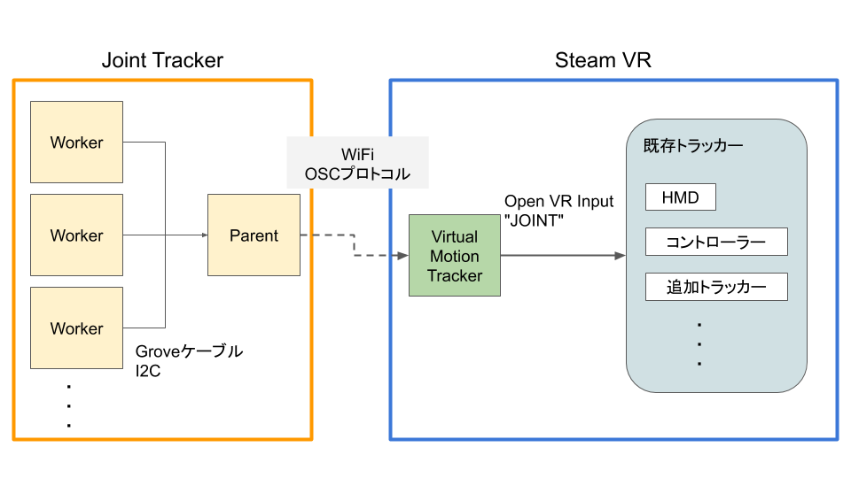

# Joint Tracker

M5シリーズの開発キットを利用した、Steam VR上で動かせるハードウェアトラッカーです。
内蔵センサを利用するので、M5 StackとAtom Matrixだけで関節の動きをトラッキングすることが可能です。

パソコンへとの通信にはWiFiを使い、Unityなどで作成したアプリでトラッキングデータを利用する他に、
Virtual Motion Tracker（後述）を利用することで、Steam VR上にトラッカーとして認識させることも可能です。

## デモ
[](https://www.youtube.com/watch?v=OgLW1Vw-JYE)


Todo 写真を載せる

Todo 動かしてる様子の動画
複雑な動作　　→　下半身 or 肘トラッカー　→　下半身用のものがあるので、VirtualCast様子を録画


# ハードウェア構成

必須
- [M5 Stack](https://www.switch-science.com/catalog/3953/)
- [M5 Atom Matrix](https://www.switch-science.com/catalog/6260/) × トラッキングしたい**関節**の数
- [Groveケーブル](https://www.switch-science.com/catalog/5215/)
- [Groveケーブルハブ](https://www.switch-science.com/catalog/796/) （用意したAtomが全て接続できる分だけ）

参考にリンクを貼っていますが、リンク先のモノを必ず購入する必要があるわけではありません

オプション
- 固定用のバンドなど
- （用途に合わせて分岐済みの）Grooveケーブル

# 必要環境

- Python 3.5以上 (Firmware書き込み用)
	- esptool
	- pyserial
- Steam VR
- [Virtual Motion Tracker](https://github.com/gpsnmeajp/VirtualMotionTracker)

推奨
- [Joint Tracker Manager](https://github.com/ixsiid/JointTrackerManager)を利用するとセットアップに便利です

# システム構成



Parentデバイス(M5 Stack)は、複数のWorkerデバイス(M5 Atom)とI2Cにより接続されます

Workerデバイスは、IMUセンサーの値から姿勢を計算（Madgwick Filterを実装）して、Parentデバイスに送出します

Parentデバイスは、WiFiを利用しOSCプロトコルで、PC側にセットアップされたVirtual Motion Trackerと通信を行います

Virtual Motion Trackerは受信データを既存のトラッカーに**JOINT**させることで、Steam VR上でトラッカーが追加されたように認識します

# セットアップ

[Joint Tracker Manager](https://github.com/ixsiid/JointTrackerManager)を利用するとセットアップに便利です

以下は、手動でセットアップする場合の詳細な手順です

Parent側デバイス、Worker側デバイスにReleaseタグからFirmwareを取得して書き込む

Parent側の設定項目
- WiFi SSID/パスワード
- データ送信先ホストのIP Address:Port
- トラッキングさせる関節のボーン構造

Worker側の設定項目
- Parent側と通信識別用のアドレス

Parent側の設定はUSB UARTによるバイナリデータの通信によって行い
Worker側の設定は、同じくUSB UARTによるテキストデータ通信によって行います


## Parent側WiFiの設定用データ構造

```cpp:WiFi Configure Data
struct {
	size_t data_length = 72;
	uint32_t command = 0x128422fd;
	char ssid[32];
	char passphrase[32];
}
```

## Parent側データ送信先ホストの設定用データ構造

```cpp:WiFi Configure Data
struct {
	size_t data_length = 16;
	uint32_t command = 0x431fac89;
	uint8_t ip[4];
	uint16_t port;
	uint16_t reserved = 0x0000;
}
```

ipは、例えば*192.168.0.1*に送信したいときは、`ip = {192, 168, 0, 1};`となります

## Parent側ボーン構造設定

ボーン構造はデバイス側IMUの座標系で定義し、
M5 Atom Matrixの場合、Z軸が重力方向となる左手系になります

XY軸方向はWorkerデバイスの起動時に定まりますが、キャリブレーション（後述）によって任意の方向に変えることができます

### トラッカーの種類

ボーン構造として、固定トラッカーと可動トラッカーの2種類を定義することが可能で
全てのトラッカーは、動作中のトラッカーに**Joint**させる必要があります

Joint先は、最低でも1つ以上の動作済みのトラッカ（VIVEコントローラーやHMDなど）が必要で、Joint済みのJointTrackerにチェイン接続を行うこともできます

### ボーン構造定義データ

ボーン構造を送信するまえに、固定・可動ボーンそれぞれの構成数を設定する必要があります

```cpp:Bone Count Configure Data
struct {
	size_t data_length = 12;
	uint32_t command = 0x38771d81;
	uint8_t fix_bone_count;
	uint8_t movable_count;
	uint16_t reserved = 0x0000;
}
```

ボーンの個数を設定後、ボーン構造を一つずつ設定します

```cpp:Bone Structure Data
struct {
	size_t data_length = 60;
	uint32_t command = (固定トラッカー) 0xf729adc8 or (可動トラッカー)0xab8cf912;
	char root_serial[20];
	uint8_t reserved = 0x00;
	uint8_t bone_index;
	uint8_t address;
	uint8_t tracker_index;
	Vector3 bone; // float[3] x,y,z
	Quaternion rotation; // float[4] x,y,z,w
}
```

ここで、各プロパティは次のとおりです

|プロパティ名|意味|
|---|---|
|root_serial|ジョイント先トラッカーのシリアルナンバー|
|bone_index|0から順に重複しない番号|
|address|対応するWorker側のアドレス（固定トラッカーの場合無視される）|
|tracker_index|Virtual Motion Trackerに認識させるトラッカー番号|
|bone|ジョイント先から、IMU座標系で記したボーンの長さ（≒位置のオフセット）|
|rotation|ジョイント先から、IMU座標系で記した回転|


なお、Virtual Motion Trackerに登録したトラッカーは、`VMT_{トラッカー番号}`というシリアルナンバーが割り当てられる


### ボーン構造定義例

腰にVIVE Trackerを装着し、下半身（両膝、両足首）をJointTrackerで定義する例

ToDo （図をいれる）

## Parent側セットアップ例

下記の内｛このように括弧で囲われた値｝はバイナリデータで送られていると考えてください

```bash
# Firmware書き込み、実際の引数は各環境に合わせて変更してください
python -m esptool --chip esp32--port COM3 --baud 460800 --before default_reset --after hard_reset write_flash -z --flash_mode dio --flash_freq 40m --flash_size detect 0x1000 ./bootloader_dio_40m.bin 0x8000 ./partitions.bin 0xe000 ./boot_app0.bin 0x10000 ./firmware.bin

(中略)

  Writing at 0x00078000... (100 %)
  Wrote 783888 bytes (441436 compressed) at 0x00010000 in 11.3 seconds (effective 555.5 kbit/s)...
  Hash of data verified.

  Leaving...
  Hard resetting via RTS pin...
# Firmware書き込み完了

# UART接続
serial console --port COM3 --baud_rate 115200
# ポートを開く（疑似クライアントソフトで記載しています）
  >
# WiFi
{72, 0x128422fd, "ssid", "password"}
  >
# Host
{16, 0x431fac89, 192, 168, 0, 1, 39570, 0}
  >
# Bone count
{12, 0x38771d81, 2, 4, 0}
  >
# Bone structures
{60, 0xf729adc8, "LHB-12345678", 0, 0,  0, 10,  0.13f, 0.0f, -0.15f, 0.0f, 0.0f, 1.0f, 0.0f}
{60, 0xab8cf912, "VMT_10",       0, 0, 11, 11,   0.0f, 0.0f, -0.38f, 0.0f, 0.0f, 0.0f, 1.0f}
{60, 0xab8cf912, "VMT_11",       0, 1, 12, 12,   0.0f, 0.0f, -0.41f, 0.0f, 0.0f, 0.0f, 1.0f}
{60, 0xf729adc8, "LHB-12345678", 0, 1,  0, 13, -0.13f, 0.0f, -0.15f, 0.0f, 0.0f, 1.0f, 0.0f}
{60, 0xab8cf912, "VMT_13",       0, 2, 14, 14,   0.0f, 0.0f, -0.38f, 0.0f, 0.0f, 0.0f, 1.0f}
{60, 0xab8cf912, "VMT_14",       0, 3, 15, 15,   0.0f, 0.0f, -0.41f, 0.0f, 0.0f, 0.0f, 1.0f}
# 再起動
{8, 0xff8d91a8}
```

## Worker側の設定

Worker側はFirmwareの書き込み後、アドレスをASCII文字列で送信して完了です

```bash
# Firmware書き込み、実際の引数は各環境に合わせて変更してください
python -m esptool --chip esp32--port COM3 --baud 1500000 --before default_reset --after hard_reset write_flash -z --flash_mode dio --flash_freq 40m --flash_size detect 0x1000 ./bootloader.bin 0x8000 ./partitions.bin 0x10000 ./firmware.bin

(中略)

  Writing at 0x00078000... (100 %)
  Wrote 783888 bytes (441436 compressed) at 0x00010000 in 11.3 seconds (effective 555.5 kbit/s)...
  Hash of data verified.

  Leaving...
  Hard resetting via RTS pin...
# Firmware書き込み完了

# UART接続
serial console --port COM3 --baud_rate 115200
# Workerアドレス設定（自動で再起動されます）
13(\r)
```

Worker側はLED Matrixに現在のアドレス値が表示されます

ToDo写真

# 使い方

M5 Stackの3つのボタンを使います

ToDo 写真

|ボタン|機能|
|---|---|
|Button A|現在のセンサー値をボーン構造の初期値として定義|
|Button B|現在のセンサー値をSteam VR空間で正面({0, 0, -1})として向きをキャリブレーション|
|Button C|トラッキングデータ送信の有効/無効切り替え（起動時は無効）|


## 利用時の流れ

- Worker側がジャイロのゼロバイアス測定が終了するのを待つ
  - ゼロバイアス測定が終了するとLEDマトリクスが緑の表示に変わります
- **Button C**を押し、トラッキングデータの送信を有効化する
- ボーン構造で定義された姿勢になり、**Button A**を押す
  - この時点で、Virtual Motion Trackerが目的の位置にあるはずです
  - ただし、Workerを動かしても、向きが異なる方向に動きます
- 全てのWorkerを正面に向けて動かして、**Button B**を押す
  - この時点で、XY平面の向きが補正されて正常なトラッキングが開始されます

ToDo 動画

# ToDo

